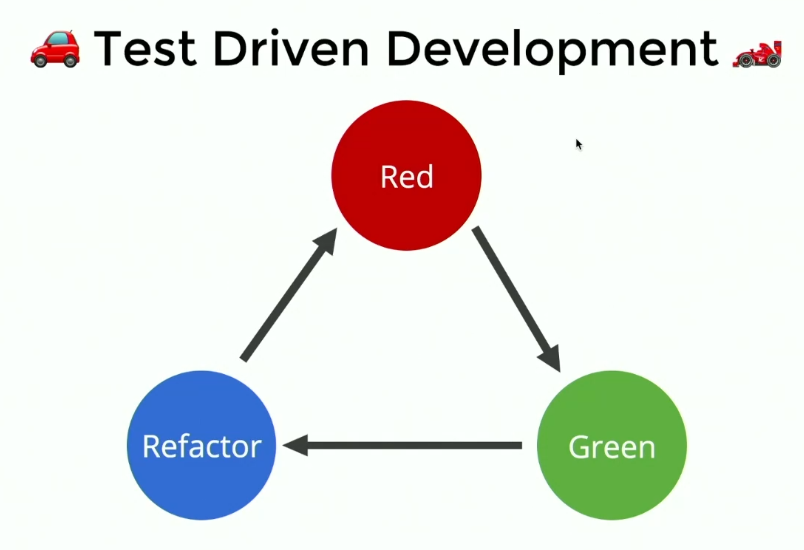

## Test Factories
Test factories are pieces of code that generate test cases on the fly. 

```js
describe('isPasswordAllowed', () => {
	const allowed = []
	const disallowed = []
	
	allowed.forEach(pwd => {
		it(`${pwd} should be allowed`, () => {
			expect(isPasswordAllowed(pwd)).toBe(true)
		})
	})
	
	disallowed.forEach(pwd => {
		it(`${pwd} should NOT be allowed`, () => {
			expect(isPasswordAllowed(pwd)).toBe(false)
		})
	})
})
``` 

> jest-in-case is a set of jest utilities that create variations of the same test

## Colocating Tests
This concept of file co-location applies great to unit tests as well. How common is it to find a project with a `src/` directory and a `test/` directory filled with unit tests that attempts to mirror the `src/` directory? All the pitfalls described above apply here as well. I probably wouldn't go as far as putting the unit tests in the exact same file, but I don't totally rule that out as an interesting idea either (the implementation is left as an exercise to the reader).

To help enable a more maintainable codebase, we should co-locate our tests files with the file or group of files they are testing. This ensures that when new people (or myself in 6 months) come to the code, they can see immediately that the module is tested and use those tests as a reference to learn about the module. When they make changes, it reminds them to update (add/remove/modify) the tests to account for their changes.

## Code Coverage
The curve of value that code coverage provides becomes too steep to maintain. The last 10% of code coverage usually involves finicky test cases that are harder to maintain and require you to change the source code in ways that might break essential functionality.


## Unit Test Purity
Pure unit tests are tests that mock all dependencies and only tests things that are within the module. The problem with it is that you lose a bit of confidence in the tests because it abstracts away potentially offensive dependency implementations with mocks, and you'd need to write extra tests to get that confidence back. 

#### Consequences of test impurity
If you choose to write impure tests that don't mock some essential dependencies such as database objects/connections, you'd be faced with another challenge. The challenge is how long tests will take. Database connections are slow and waste a lot of time. This would cause your tests to take much longer than expected. 

One solution to the problem is to initialize the database _once_ before all tests and then hope your tests can work on the same data. Each test would cleanup after itself but the database instance will be initialized once and reused everywhere. This is much faster than having to initialize the database before each test. 

> Impure tests can also be labelled as integration tests. Tests that mock all their dependencies are labelled as unit tests because they're only focused on the unit they're testing, not its integration with dependencies.

## beforeEach or afterEach?
If you use an `aftereach` to re-initialize the database every time your test runs or clean up the database, what's going to happen is your test will fail, and then your `aftereach` will run to clean up the database. And so now you can't inspect the database to see what was wrong with the database.

And so if instead you do all the cleanup ahead of time, then your tests can still run in isolation from each other. They just clean things up before each run, but if something breaks then you can check out with the status of the databases at the time it broke.

## TDD - Test Driven Development



1. Write some tests that fail (red)
2. Write some code for them to pass (green)
3. Continue implementing the feature you're trying to build

The refactor step makes sure that the code you're writing is maintainable and understandable. Don't skip over it because the result will be more harm than good.

In general, keep your tests as minimal as possible. Doing that will in turn keep your source units minimal and highly focused, leading to more readable and maintainable code.

## RDD - Readme Driven Development
A principle of software development in which you document what you want before getting down to implementation.

> TDD is something that you need to build an intuition for and kinda force yourself to do at the beginning when you're not used to it. 

## TDD Exceptions
- If you don't already know what the APIs that you're going to be hitting look like, it may be hard to write a valid test
- If you're not sure what the interaction between the unit you're testing and its dependencies will beww

## Starting NodeJS Process for Tests
Starting a NodeJS server could require a fair amount of time so you might boot up your server in a process and then in a separate process start your testing process. But if you can, try to have the process that's running your tests start the server you're testing as well. You can do that using Node APIs. 

This allows Jest and other testing frameworks to instrument all the codebase for code coverage and reporting, etc. You'll also have more transparent errors since all errors will just propagate to your testing process. 
